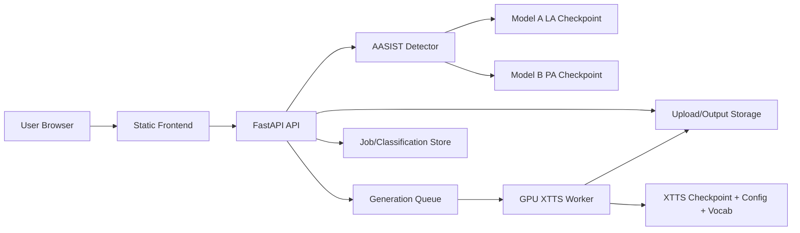

# Deployment Strategy

Status: Phase 4 strategy recommendation before implementation.

## Deployment Options Compared

### Fully CPU Deployment

Best for:

- Detection-only demo.
- Low-cost public portfolio deployment.
- Fast launch.

Pros:

- Cheap.
- Simple Docker image.
- No GPU availability issues.
- AASIST checkpoints are small.

Cons:

- XTTS generation will be too slow for a good live demo.
- Full project story is not demonstrated unless generation is disabled or mocked.

Recommendation: best first production milestone.

### GPU Deployment

Best for:

- Live voice cloning.
- Full VoiceLab experience.
- Demo where users upload reference voice and generate audio.

Pros:

- Supports XTTS generation properly.
- Better UX for generation latency.

Cons:

- Higher cost.
- Larger image/model setup.
- Needs queueing and abuse controls.
- Model storage must be handled carefully.

Recommendation: second milestone after detection-only deployment is stable.

### Hybrid Deployment

Best for:

- Production-ready architecture.

Design:

- CPU web/API service handles frontend, uploads, detection, history, and health.
- GPU worker handles generation asynchronously.
- Shared object storage holds uploads and outputs.
- Redis or managed queue coordinates jobs.

Pros:

- Cost control.
- Scales detection and generation independently.
- Better reliability.

Cons:

- More moving parts.
- Requires object storage and queue setup.

Recommendation: best long-term architecture.

### Demo Deployment

Best for:

- Resume/project showcase.

Design:

- Detection live.
- Generation optional:
  - either disabled with clear UI state when no GPU model is configured,
  - or limited to pre-generated examples,
  - or backed by a single small GPU Space.

Recommendation: best public demo plan if budget is limited.

## Provider Comparison

| Provider | Fit | Notes |
|---|---|---|
| Render | Good for CPU FastAPI detection demo | Not ideal for large GPU XTTS. |
| Railway | Good for simple CPU app | Storage/model-size constraints need care. |
| Hugging Face Spaces | Good for ML demos | GPU available, model hosting story is natural, may sleep or cost by hardware. |
| AWS | Best flexibility | More setup; ECS/Fargate for CPU, EC2/GPU or SageMaker for GPU. |
| GCP | Good GPU and Cloud Run options | GPU deployment can become costly. |
| Azure | Similar to AWS/GCP | More enterprise-oriented overhead. |
| VPS | Good cheap CPU detection host | GPU VPS is more specialized and still costly. |

## Recommended Cheapest Practical Option

### Milestone 1: Detection-Only Production Demo

Use a CPU container on Render, Railway, Hugging Face Spaces CPU, or a cheap VPS. Based on prices checked on 2026-08-20, this can range from free/sleeping tiers to roughly $13/month for a small always-on Render-style stack, before bandwidth and storage growth.

Production behavior:

- Enable `/classify`.
- Disable `/generate` unless XTTS paths are configured.
- Keep health endpoint.
- Add clear deployment docs.
- Do not ship ASVspoof data or XTTS checkpoints.

Why:

- It uses the strongest, smallest production asset: the AASIST detector.
- It is cheap and realistic.
- It avoids deploying 5+ GB XTTS weights before queueing/storage are ready.

### Milestone 2: Full Hybrid Demo

Use Hugging Face Spaces GPU or a cloud GPU instance for the generation worker. Current always-on GPU estimates are roughly $292/month for T4 small, $584/month for L4, and $730/month for A10G small on Hugging Face Spaces. RunPod L4 starts around $0.39/hr. AWS g4dn.xlarge T4 is roughly $384/month and AWS g6.xlarge L4 is roughly $588/month in us-east-1.

Production behavior:

- Web/API remains CPU.
- GPU worker loads selected XTTS model.
- Uploads/outputs stored externally.
- Requests become async jobs.

## Required Deployment Work Before Any Live URL

- Restore missing source files.
- Add `.gitignore`.
- Add `.env.example`.
- Move runtime data paths out of source directories.
- Add Dockerfile.
- Add production requirements.
- Add healthcheck.
- Add startup flags for detection-only mode.
- Add tests for app import, `/health`, and classifier path handling.
- Decide model hosting method.

## Architecture Diagram

## Production Recommendation

Start with detection-only CPU deployment, then add GPU XTTS generation as an async worker. This is the cheapest path that still becomes production-ready without pretending a 5.35 GB per-speaker XTTS checkpoint belongs inside a simple web host.
